# Fork Status — robot_comic

A consolidated snapshot of what this fork (`TheKentuckian/robot_comic`) has added
since branching from `pollen-robotics/reachy_mini_conversation_app`, the outstanding
milestones, a speech-to-speech smoke-test checklist, and answers to recurring
diagnostic questions (XTTS reliability, WSL/Dev-Drive, worktree corruption).

Authoritative status documents this rolls up: `NOW.md` (30-day window),
`PIPELINE_REFACTOR.md` (Phase 4/5 epic), `plan.md` (install), `VOICE_CLONE.md`,
`LOCAL_LLM.md`, `FUTURE_RESEARCH.md` (hardware-blocked parking lot).

For the *live* view of open work, see the issue dashboard (`docs/dashboard.md`):
issues are sorted into **lanes** (functional / technical / improvement) and
**milestones** (the goals below) and rendered as a Projects v2 board. This
document remains the narrative context behind those milestones.

*Last updated: 2026-05-19 (HEAD `172c6f5`).*

---

## 1. What's been added since the fork

The block diagram below shows the major modules and how they fan out from
`main.py`. Anything labelled `[NEW]` did not exist in the upstream
`reachy_mini_conversation_app` tree and was built in this fork.

```mermaid
flowchart TB
  subgraph ENTRY["Entry & lifecycle (mostly NEW)"]
    main["main.py<br/>--sim / --debug / --monitor"]
    warmup["warmup_audio.py [NEW]<br/>fire-and-forget welcome WAV"]
    startupT["startup_timer.py [NEW]<br/>boot-latency stopwatch"]
    telemetry["telemetry.py [NEW]<br/>OpenTelemetry / SigNoz"]
    welcome["welcome_gate.py [NEW]<br/>persona-name gate (#108/#110)"]
    pause["pause.py + pause_settings.py [NEW]<br/>stop-word menu (robot/reachy prefix)"]
  end

  subgraph FACTORY["Handler routing"]
    factory["handler_factory.py [NEW]<br/>(STT, LLM, TTS) triple -> handler"]
    config["config.py [overhauled]<br/>FACTORY_PATH retired, XTTS knobs"]
  end

  subgraph BUNDLED["Bundled realtime (kept + extended)"]
    base["base_realtime.py"]
    openai["openai_realtime.py"]
    hf["huggingface_realtime.py"]
    glive["gemini_live.py [NEW]"]
    hybrid["local_stt_realtime.py [NEW]<br/>LocalSTT + cloud LLM/TTS hybrid"]
  end

  subgraph COMPOSABLE["Composable pipeline [NEW — Phase 4/5 epic]"]
    backends["backends.py<br/>STTBackend / LLMBackend / TTSBackend Protocols"]
    pipeline["composable_pipeline.py<br/>tool dispatch + echo-guard + joke history + history trim"]
    cch["composable_conversation_handler.py<br/>FastRTC-shim wrapper"]
    subgraph STT["STT adapters"]
      moonshine["MoonshineSTTAdapter"]
      fwhisper["FasterWhisperSTTAdapter (#416)"]
    end
    subgraph LLM["LLM adapters"]
      llama["LlamaLLMAdapter (llama.cpp/Qwen3-14B)"]
      gem["GeminiLLMAdapter"]
      gemB["GeminiBundledLLMAdapter"]
    end
    subgraph TTS["TTS adapters"]
      cb["ChatterboxTTSAdapter (LAN, voice clone)"]
      el["ElevenLabsTTSAdapter"]
      gtts["GeminiTTSAdapter (3.1-flash-tts)"]
      xtts["XttsTTSAdapter [NEW #442]<br/>LAN xtts-v2, raw PCM stream"]
    end
  end

  subgraph TOOLS["Tools (mostly NEW)"]
    core["tools/core_tools.py<br/>Tool ABC + ToolDependencies"]
    bg["background_tool_manager.py"]
    greet["greet (face DB)"]
    roast["roast"]
    lang["language_dissect"]
    dance["dance / stop_dance"]
    emo["play_emotion / stop_emotion"]
    cam["camera"]
    head["head_tracking / move_head"]
    crowd["crowd_work"]
    namev["name_validation"]
  end

  subgraph MOTION["Motion (NEW)"]
    mm["moves.MovementManager<br/>~100 Hz worker thread"]
    moves["dance_emotion_moves.py"]
    safety["motion_safety.py"]
    wob["audio/head_wobbler.py [NEW]<br/>speech-reactive sway"]
  end

  subgraph VISION["Vision (NEW)"]
    cw["camera_worker.py"]
    lv["vision/local_vision.py (SmolVLM2)"]
    ht["vision/head_tracking/ (mediapipe | yolo)"]
    fdb["vision/face_db.py + embedder"]
  end

  subgraph AUDIO["Audio I/O (NEW)"]
    alsa["audio_input/alsa_rw_capture.py<br/>RW capture from reachymini_audio_src"]
    gain["audio_gain.py"]
    tap["audio/speech_tapper.py"]
  end

  subgraph UI["Admin / settings UI (NEW)"]
    console["console.LocalStream<br/>FastAPI + FastRTC bridge"]
    persUI["headless_personality_ui.py"]
    static["static/index.html, main.js, main.css"]
  end

  subgraph PROFILES["Profiles (NEW)"]
    p["profiles/default + house_comedian<br/>+ EXTERNAL_PROFILES_DIRECTORY"]
    opens["openers.py + joke_history.py"]
    trim["history_trim.py + gemini_retry.py"]
    guard["guardrail.py"]
  end

  subgraph STTSVC["stt_service/ [NEW PR #473]"]
    sttsvr["server.py — standalone FastAPI (not yet wired into main.py)"]
  end

  subgraph WS["Pi <-> laptop WS [NEW]"]
    wsp["ws_protocol / ws_client / ws_server"]
    wol["wake_on_lan.py"]
  end

  main --> warmup
  main --> startupT
  main --> telemetry
  main --> welcome
  main --> pause
  main --> factory
  factory --> config
  factory --> base
  factory --> cch
  base --> openai
  base --> hf
  base --> glive
  base --> hybrid
  cch --> pipeline
  pipeline --> backends
  backends --> STT
  backends --> LLM
  backends --> TTS
  main --> mm
  main --> cw
  main --> console
  main --> wob
  pipeline --> core
  core --> bg
  core --> greet
  core --> roast
  core --> lang
  core --> dance
  core --> emo
  core --> cam
  core --> head
  core --> crowd
  core --> namev
  cw --> lv
  cw --> ht
  cw --> fdb
  console --> static
  console --> persUI
  persUI --> p
  pipeline --> opens
  pipeline --> trim
  pipeline --> guard
  llama --> wol
  cb --> WS
  xtts --> WS
```

### Prose summary

- **Bundled realtime** (`base_realtime.py` + `openai_realtime.py` +
  `huggingface_realtime.py`) is the original upstream shape. Gemini Live
  and the LocalSTT hybrid handlers were added.
- The entire **Composable pipeline** stack is new — Phase 4 (epic #337,
  closed 2026-05-16) and Phase 5 (5a–5f, all sub-phases ✅ as of
  PR #426). This decoupled STT/LLM/TTS into Protocol-based backends and
  is now the only path through the factory; `BACKEND_PROVIDER`,
  `LOCAL_STT_RESPONSE_BACKEND`, and `FACTORY_PATH` were added, used,
  and retired during the epic.
- **TTS adapters:** four — Chatterbox (LAN, voice clone), ElevenLabs,
  Gemini TTS, and XTTS-v2 (added #442, hardened in #463/#466/#467/#468).
- **STT adapters:** two — Moonshine (default) and faster-whisper (#416,
  with cascade-hardening in 5f-1/-2/-3: webrtcvad swap #420, echo
  cooldown #422, content-similarity filter #426).
- **Tools, motion, vision, admin UI, profiles, telemetry, audio
  plumbing, Pi↔laptop WS channel, OpenTelemetry**: all post-fork
  additions.
- **Open seams:** standalone `stt_service/` package (PR #473) is shipped
  but not yet wired into the main app. XTTS LAN service uptime is the
  remaining stability concern (see §4 Q1).

---

## 2. Outstanding milestones

### In flight (need on-robot validation)

- **#155** `wake_up` animation physical smoothing — IK / motion-profile gentling.
- **#138** Admin **Restart** end-to-end test (exit-75 → systemd relaunch).
- **#121** Boot: investigate 11.5 s gap between movement-manager init and handler ready.
- **#108** Welcome Gate: finish remaining `welcome_name.wav` assets (5 comedians + 6 characters).

### Next up

- **#54** Modular audio pipeline — finish split of `AUDIO_INPUT_BACKEND` + `AUDIO_OUTPUT_BACKEND` configuration.
- **#78** Benchmark Qwen3 14B dense vs 35B MoE on the production prompt set.
- **#20** Basic L-R movement testing on the real robot.
- **#19** Servo calibration: avoid body collisions.

### Pipeline-refactor tail

All Phase 5 sub-phases (5a–5f) are ✅ done. Doc-only mismatch: the
`PIPELINE_REFACTOR.md` table previously labelled 5c and 5d as "pending
operator input/decision". Both are merged:

- 5c-1 (#399, commit `101d07b`) and 5c-2 (#401, commit `e3ab697`).
- 5d shrink (#403, commit `c8fef7d`) — `ConversationHandler` ABC is now
  72 lines, FastRTC-shim only.

### XTTS-v2 stabilization tail (all landed)

- **#442** wire LAN xtts-v2 as composable TTSBackend + admin UI selector.
- **#463** scope chatterbox TTS probes to `AUDIO_OUTPUT_BACKEND=chatterbox`.
- **#466** TTS-down cooldown — suppress STT triggers on service outage.
- **#467** wire `speaking_until_setter` to close self-echo barge-in gap.
- **#468** post-TTS cooldown + stricter `no_speech_prob` to stop
  hallucination cascade.

Remaining: not adapter correctness, but **xtts-v2 service uptime** — see §4 Q1.

### Carry-forward issue

- **#473** `stt_service/` standalone FastAPI package shipped; not yet
  wired into `main.py` or the handler factory. Carry to next sprint.

### Hardware-blocked (parked in `FUTURE_RESEARCH.md`)

No changes — that document is the parking lot for items requiring the
physical robot, training compute, or open-ended ML research.

---

## 3. Speech-to-speech smoke-test checklist

Run this on your laptop (not this remote container — no audio hardware
here). Target backend is **Gemini Live**: single websocket, no
dependency on local llama-server or LAN xtts-v2.

### Pre-flight

1. `export UV_PROJECT_ENVIRONMENT=/venvs/apps_venv`
2. `cd <repo>` and confirm branch / commit (`git status`, `git log -1`).
3. `uv pip install -e .` (refresh in case `pyproject.toml` moved).
4. Confirm `.env` has `GOOGLE_API_KEY` and **no stale**
   `MODEL_NAME=gemini-3.1-flash-live-preview` — that one is a known Pi
   leftover (`VOICE_CLONE.md` Session 2).

### Run

5. `python -m robot_comic.main --sim --debug`
6. Open `http://localhost:7860/` (admin UI). Pick a persona with
   `gemini_live.txt` configured (the `house_comedian` profile has one).
   Click **Apply**.
7. Open `http://localhost:7860/chat` in a second tab — FastRTC audio
   bridge.
8. Click **Start**, grant mic access, speak:
   *"Hey robot, tell me a joke about Mondays."*

### Verify (pass criteria = all 5)

9. Transcript line appears in the admin UI within ~1–2 s of utterance end.
10. First audio chunk plays back within ~2–4 s of utterance end.
11. Persona voice matches the profile's `gemini_live.txt` delivery
    styling (PR #188).
12. Second utterance does **not** trigger self-echo (the bot's voice
    must not come back as a user turn). This exercises the
    #91/#466/#467/#468 echo-guard chain.
13. Trigger a tool call: *"Do a happy dance."* — the dance should fire
    (verify in `--monitor` or, on robot, `journalctl -u
    reachy-app-autostart -f`).

Then send the stop word: *"Robot, stop."* — confirm the pause menu is
reachable.

### Fallback: composable triple

If Gemini Live quota is tripped (free tier ≈ 10 req/day per
`CLAUDE.md`), switch the admin UI to `(moonshine, llama, gemini_tts)`.
Requires `llama-server` on `astralplane.lan:11434` (Wake-on-LAN supported
via #203 if it's asleep). Re-run steps 8–13.

---

## 4. Q&A

### Q1. Why does XTTS keep breaking, and what is the permanent fix?

**What broke (historically):**

| PR | Failure mode | Fix |
|----|--------------|-----|
| #463 | Chatterbox pre-flight TTS probe fired even when `AUDIO_OUTPUT_BACKEND=xtts`, failing boot if Chatterbox host was unreachable | Scope probe to the active backend |
| #466 | When LAN xtts-v2 was unreachable, STT still rearmed each turn → cascade of hallucinated transcripts | Add a TTS-down cooldown that suppresses STT triggers |
| #467 | `XttsTTSAdapter` was not feeding `speaking_until` to the STT echo-guard → bot heard itself | Thread `speaking_until_setter` through the adapter, mirroring ElevenLabs |
| #468 | Residual hallucination window between TTS end and STT rearm | Post-TTS cooldown + stricter `no_speech_prob` |

**Root cause pattern:** XTTS is a **remote LAN service**, and the rest
of the pipeline was originally written assuming TTS is in-process. Each
break was a coupling assumption (probe scope, echo-guard state,
cooldown timing, STT rearm) that didn't matter for bundled TTS but
matters when TTS is a flaky LAN HTTP service.

**Permanent solution — three legs, all server-side / packaging, not
adapter changes:**

1. **Service-uptime hardening.** The adapter is now correct; the
   failure surface is the xtts-v2 process. Run it as a Windows service
   (NSSM or `sc.exe create`) with an autorestart watchdog, parallel to
   how `Start-RobotServices.ps1` runs llama-server. Capture logs to
   `C:\Logs\xtts-v2.log`. This matches `VOICE_CLONE.md` Decision #5
   pattern.
2. **Pin `transformers==4.40.2` on the xtts-v2 host.** XTTS streaming
   breaks on newer Transformers versions
   ([coqui/XTTS-v2 model card](https://huggingface.co/coqui/XTTS-v2);
   [coqui-ai/TTS Discussion #3544](https://github.com/coqui-ai/TTS/discussions/3544)).
   Document the pin in `VOICE_CLONE.md` and add a startup assertion in
   the xtts service's launch script.
3. **`/health` endpoint + adapter warmup probe.** `XttsTTSAdapter`
   currently has `/speakers` and `/tts_stream` but no cheap liveness
   check. Add `GET /health` server-side (200 + `model_loaded: true`),
   wire a one-shot probe at handler `start_up`, and surface
   "xtts down — falling back" in the admin UI rather than entering the
   cascade fallback path. File as a small follow-up issue.

If XTTS is no longer needed as an alternate voice engine, the simplest
"permanent fix" is to remove it: Chatterbox already covers voice clone
in-tree.

### Q2. Will WSL / moving repos under Linux give better performance? And where does Dev Drive actually sit?

**Short answer:** **Not for what this project does on Windows.** The
decisions in `VOICE_CLONE.md` Decision #1 and `LOCAL_LLM.md` Decision #1
(native Windows for Chatterbox + llama.cpp + xtts-v2) are still right.

**Why not WSL2 for the model-serving stack:**

- WSL2 averages ≈ 87–88 % of native Linux on disk/CPU benchmarks; the
  cross-FS penalty (`\\wsl$\Ubuntu` vs `/mnt/c`) is real
  ([Microsoft Learn — working across filesystems](https://learn.microsoft.com/en-us/windows/wsl/filesystems)).
- WSL2 GPU passthrough is near-native for compute, but **native Windows
  CUDA wheels are still faster for model load** — PyTorch
  `.safetensors` through VirtioFS is measurably slower than NTFS/ReFS.
- WSL2 services do not survive lock screen / logout the way native
  Windows services do; your laptop hosts the Pi-facing services and
  gets locked.
- WSL2 mirrored networking still conflicts with Docker Desktop on some
  setups ([Microsoft Learn — WSL config](https://learn.microsoft.com/en-us/windows/wsl/wsl-config)).

**Where things actually sit on disk:**

- A WSL2 distro lives in a single VHDX at
  `%USERPROFILE%\AppData\Local\Packages\<DistroPackageName>\LocalState\ext4.vhdx`.
  Inside the distro that's `/`
  ([linuxvox — where WSL2 files sit](https://linuxvox.com/blog/where-are-the-files-inside-wsl2-physically-stored/)).
- **Dev Drive is a separate ReFS volume** you create from
  *Settings → System → Storage → Disks & volumes → Create dev drive*
  ([Microsoft Learn — set up Dev Drive](https://learn.microsoft.com/en-us/windows/dev-drive/)).
  It is its own drive letter — typically `D:` here; your existing
  `D:\Projects\` paths in `VOICE_CLONE.md` and `LOCAL_LLM.md` already
  put models and llama.cpp on it. Git, npm, pip, MSVC all see the same
  paths as on NTFS.
- WSL2 *can* mount Dev Drive via DrvFs (`/mnt/d`), but you pay the full
  cross-FS penalty — defeats the point
  ([Box of Cables — Dev Drive benchmarks](https://www.boxofcables.dev/windows-dev-drive-benchmarks/)).

**Concrete guidance for this repo:**

- Keep the code repo on **Dev Drive (`D:\`)**, native Windows. Dev
  Drive's AV exclusions + ReFS metadata caching are the biggest win
  for git / pytest / pip-install loops.
- Keep **llama.cpp + xtts-v2 + Chatterbox models on `D:\`**. Model load
  is the most I/O-sensitive path.
- Use WSL2 only for Linux-specific tooling you don't want on Windows
  (e.g. `journalctl` over ssh to the Pi, occasional cross-check
  `ruff`/`mypy` runs). Don't move the repo there.
- One-time benchmark if you want to settle it: clone once into
  `\\wsl$\Ubuntu\home\you\robot_comic` and run `pytest tests/ -q`
  head-to-head. With your model-load and Windows-service constraints
  the delta will not justify a move.

### Q3. Is the worktree corruption issue actually resolved? Is it a Windows symptom WSL would fix?

**What's in the repo today:**

- Agent-CWD-leak safeguard from issue #305 is live:
  - `.claude/hooks/check_worktree_cwd.py` PreToolUse hook blocking
    `git checkout -b NEW`, `git switch -c NEW`, `git worktree add` from
    the main-repo CWD when an active agent worktree exists.
  - Self-check canary in `.claude/AGENTS.md` for subagents under
    `isolation: worktree`.
- `scripts/cleanup-worktrees.sh` + `tests/test_cleanup_worktrees_script.py`
  exercising worktree hygiene in CI.
- No "corruption-of-main" post-mortem in the commit log — the bugs that
  hit you were CWD leaks, not on-disk corruption.

**Is it a Windows symptom?** Partially, but **not in a way WSL fixes**.
The underlying flaw was the agent harness's working-directory model,
not the OS. WSL would change nothing here — the same hook is needed on
Linux. What WSL *would* improve: git file-locking quirks and
case-sensitivity surprises on NTFS are gentler on ext4 (no
`core.protectNTFS` foot-guns, no path-length surprises)
([git-tower — repairing worktrees on Windows](https://www.git-tower.com/help/guides/worktrees/repair/windows);
[git-scm — git-worktree](https://git-scm.com/docs/git-worktree)).
Those are real but unrelated to the CWD-leak bug.

**Status:** the class of bug that clobbered main is **structurally
prevented** by the hook + canary as long as every dispatch goes through
the Claude Code harness. External operations (Explorer rm, Git Desktop
merge, `worktree add` from an unwrapped terminal) can still mis-state
things — they bypass the hook by construction.

**Optional next preventive step** (small follow-up issue): a local
`pre-receive` hook on `origin` that rejects pushes to `main` from a
worktree path. Catches the external case too.

---

*References used:*

- [coqui/XTTS-v2 model card](https://huggingface.co/coqui/XTTS-v2)
- [coqui-ai/TTS Discussion #3544 — fine-tuned models, server fixes](https://github.com/coqui-ai/TTS/discussions/3544)
- [Microsoft Learn — Working across Windows and Linux file systems](https://learn.microsoft.com/en-us/windows/wsl/filesystems)
- [Microsoft Learn — Set up a Dev Drive on Windows 11](https://learn.microsoft.com/en-us/windows/dev-drive/)
- [Microsoft Learn — WSL config (mirrored networking, advanced settings)](https://learn.microsoft.com/en-us/windows/wsl/wsl-config)
- [linuxvox — Where are WSL2 files physically stored?](https://linuxvox.com/blog/where-are-the-files-inside-wsl2-physically-stored/)
- [Box of Cables — Windows Dev Drive Benchmarks](https://www.boxofcables.dev/windows-dev-drive-benchmarks/)
- [git-tower — Repairing Worktrees (Windows)](https://www.git-tower.com/help/guides/worktrees/repair/windows)
- [git-scm — git-worktree documentation](https://git-scm.com/docs/git-worktree)
